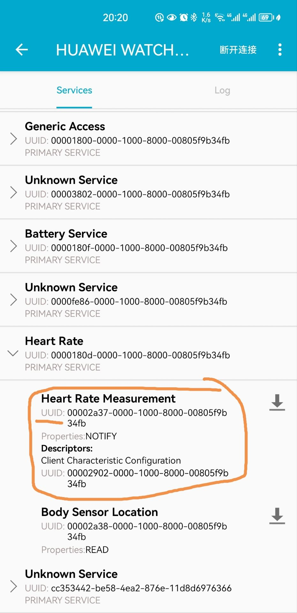

# 低功耗蓝牙（BLE）广播监听程序

## 1. 简介

这是一个示例程序，用于监听低功耗蓝牙广播，并将广播内容显示为视觉信息。该程序实现的功能为：查找附近的心率监测设备（如智能手表、手环、心率带），与其建立连接并监听其发送的心率广播，将实时心率显示在屏幕的特定位置（如右上角、游戏血条附近）。UI设置为透明背景、固定位置、置顶显示、不可点击。

效果图：

 

（是的，一开始就是为了游戏写的）

## 2. 依赖库与硬件要求

本项目主要基于bleak实现，除bleak外其他依赖库均为python3.4+自带

硬件要求：无线网卡，且系统中安装了蓝牙驱动

依赖：

```
tkinter
threading  
asyncio  
bleak
```

## 3. 如何使用

首先，获取你的BLE设备的MAC地址，和该设备心率广播服务的Characteristic UUID，下面以华为手表为例：

打开ble调试助手app，打开心率设备的ble广播，找到你的设备，设备名称下方就是mac地址：


连接后找到心率广播服务，记录下对应的UUID：



修改代码中的 `par_device_addr`为你的设备MAC地址，修改 `par_notification_characteristic`为你设备心率广播服务的uuid；

然后，按你的喜好修改字体颜色以及显示位置；

最后，运行。

PS: 设置正确但连接失败是正常的，多试几次。

# Bluetooth Low Energy (BLE) Broadcast Listening Program

## 1. Introduction

This is an example program designed to listen for Bluetooth Low Energy (BLE) broadcasts and display the broadcast content as visual information. The program's functionality includes: searching for nearby heart rate monitoring devices (such as smartwatches, fitness bands, or heart rate straps), establishing a connection with them, and listening to their heart rate broadcasts. The real-time heart rate is displayed in a specific location on the screen (e.g., near the top right corner or next to the health bar in a game). The UI is set to have a transparent background, a fixed position, remain on top of other windows, and be non-clickable.

Illustration:


(The heart rate of the game character is displayed above the health bar, while the player's heart rate is displayed below it. Yes, it was originally written for a game.)

## 2. Dependencies and Hardware Requirements

This project is mainly based on the Bleak library. Apart from Bleak, all other dependencies are included with Python 3.4+ by default.

 **Hardware Requirements** : A wireless network card and Bluetooth drivers installed on the system.

 **Dependencies** :

```
tkinter
threading  
asyncio  
bleak
```

## 3. How to Use

First, obtain the MAC address of your BLE device and the Characteristic UUID of its heart rate broadcast service. The following example uses a Huawei watch:

Open the BLE debugging assistant app, enable the BLE broadcast of the heart rate device, and locate your device. The MAC address will be displayed below the device name:


After connecting, find the heart rate broadcast service and note down the corresponding UUID:


Modify `par_device_addr` in the code to your device's MAC address, and modify `par_notification_characteristic` to the UUID of your device's heart rate broadcast service.

Then, adjust the font color and display position according to your preference.

Finally, run the program.

 **Note** : It’s normal for the connection to fail even if the settings are correct. Try a few more times.
